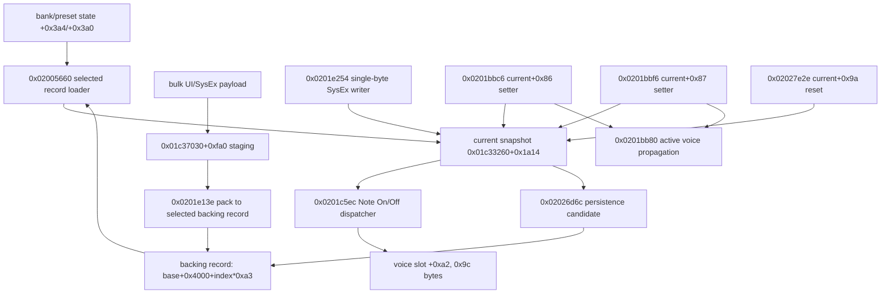

# v15 runtime source trace for 0x01c34c74

Scope: official v15 only. This pass reads `build/v15-official-app.bin` and v15 Quarkslab/Kagaimiq listings only. It performs no patching and no flashing.

## SHA gates

- app: `36fe8299667d06d4e2c195ea0b125b8e3400a4dc010b45d6989354dd4e172055` (PASS)
- official package: `f7f1831cd7c9ad8b4831b6e71ea0bdbcdff9ae4c4077276b3c965511bf4d4fff` (PASS)
- Quarkslab exhaustive listing: `f51e384f5f0efc415f321bbfbbe15d051301953338191282872807dcf8683347` (PASS)
- Kagaimiq exhaustive listing: `814510c15ba600c7420026204c5f4121bce6a5d074422cc20204755d3280e013` (PASS)

## 결론

- `0x01c34c74`는 독립 static DX7 blob이 아니라 `0x01c33260 + 0x1a14`인 **현재 패치 runtime snapshot**이다.
- direct absolute raw pointer는 `0x0201c604`의 immediate 하나뿐이며, 이는 `0x0201c5ec` consumer가 `r8=0x01c34c74`를 만드는 행이다. writer는 base alias `0x01c33260 + 0x1a14`로 나타난다.
- 주 writer는 `0x02005660`이다. selected bank/preset으로 backing record를 고른 뒤 `memcpy(0x01c34c74, backing+0x4000+index*0xa3, 0xa3)`를 수행하고 packed fields를 current snapshot 안에 확장한다.
- UI/current patch 변경은 `0x0201e254`가 bulk payload를 staging에 받고 `0x0201e13e`로 selected backing record에 pack한 뒤 `0x02005660`을 호출해 `0x01c34c74`를 갱신하는 경로와, 7-byte `F0 43 10 ... F7`가 `0x01c34c74+idx`에 직접 1 byte를 쓰는 경로가 있다.
- 추가 direct writer는 `0x0201bbc6`의 current+`0x86` bounded setter, `0x0201bbf6`의 current+`0x87` bounded setter, 그리고 `0x02027e2e`의 current+`0x9a` zero reset이다. 두 setter는 `0x0201bb80`을 호출해 active voice state에도 paired field를 전파한다. 계산형 또는 table 기반 ingress 때문에 setter의 상위 UI 호출 지점은 정적으로 확정하지 못했다.
- `0x0201c5ec`의 `0x9c` copy는 Note On/Off 시 현재 패치 snapshot의 tone/program 파라미터 부분을 per-voice slot `engine + voice*0xa0 + 0xa2`로 복제하는 소비 경로다. pitch bend는 별도 `E0` path에서 `engine+0x3e` 14-bit 값을 갱신하므로, Note On 중 pitch 하강은 static snapshot target-tone 가설의 근거가 아니다.
- current source 대상 memset/fill writer는 이 trace에서 발견되지 않았다. 확인된 갱신은 `memcpy`, field-wise stores, 그리고 backing-record producer 후 reload이다.
- 기존 분석 일부의 'loader destination과 `0x01c34c74`가 다르다'는 해석은 산술적으로 반증된다. `0x01c33260 + 0x1a14 = 0x01c34c74`이므로 동일 RAM byte range의 두 alias다.

## Raw xref summary

- `current_source_buffer_0x01c34c74` `0x01c34c74`: count `1`, refs `0x0201c604`
- `ram_object_base_0x01c33260` `0x01c33260`: count `492`, refs `0x02000696`, `0x020006a8`, `0x020006ba`, `0x020006d0`, `0x020006de`, `0x020006f0`, `0x020007ea`, `0x02000816`, `0x0200083e`, `0x02000856`, `0x0200089c`, `0x02000d56`
- `current_source_end_0x01c34d10` `0x01c34d10`: count `0`, refs none
- `dispatcher_0x0201c5ec` `0x0201c5ec`: count `0`, refs none
- `factory_loader_0x02005660` `0x02005660`: count `0`, refs none
- `current_packer_0x0201e13e` `0x0201e13e`: count `0`, refs none
- `storage_transfer_0x02004b02` `0x02004b02`: count `0`, refs none
- `memcpy_0x02048cce` `0x02048cce`: count `0`, refs none

## Writers/producers/consumers

### record_loader_to_current_snapshot

- kind: `memcpy`
- destination: `0x01c33260+0x1a14 == 0x01c34c74`
- source: `*(0x01c33260+0x164)+0x4000+(bank*32+preset)*0xa3`
- length: `0xa3`
- summary: 0x02005660 computes (selected_bank*32+selected_preset)*0xa3 from *(0x01c33260+0x164), adds 0x4000, and memcpy()s 0xa3 bytes into 0x01c33260+0x1a14.
- key rows:
  - `02005682	d1ec4476	ldw	ldw r7,r4,#0x164	FALL_THROUGH	FUN_02005660@02005660`
  - `0200568a	e0e1a300	mul	mul r0,r0,#0xa3	FALL_THROUGH	FUN_02005660@02005660`
  - `02005690	e1e0800c	add	add r1,r0,0x4000	FALL_THROUGH	FUN_02005660@02005660`
  - `02005694	10e1144a	add	add r0,r4,0x1a14	FALL_THROUGH	FUN_02005660@02005660`
  - `02005698	6a23	mov	mov r2,#0xa3	FALL_THROUGH	FUN_02005660@02005660`
  - `0200569a	80ff2e360400	call	call 0x02048cce	UNCONDITIONAL_CALL	FUN_02005660@02005660`

### packed_record_normalization_inside_current_snapshot

- kind: `field_wise_expand`
- destination: `0x01c33260+0x1a14..+0x1a91 field aliases`
- source: `selected packed bank record bytes`
- summary: After the raw 0xa3 copy, 0x02005660 loops over 0x7e bytes in 0x15-byte logical operator blocks and rewrites unpacked fields into the same current snapshot area starting at +0x1a14 and +0x1a24.
- key rows:
  - `020056b4	231d	add	add r3,r2,r4	FALL_THROUGH	FUN_02005660@02005660`
  - `020056b6	15e1143a	add	add r5,r3,0x1a14	FALL_THROUGH	FUN_02005660@02005660`
  - `020056c0	108a	rep	rep #0x4,#0xb	FALL_THROUGH	FUN_02005660@02005660`
  - `020056c4	f007	sb	sb r0,[r7 ++= 1]	CONDITIONAL_JUMP	FUN_02005660@02005660`
  - `020056c6	185b	lb.z	lb.z r0,[r1 + -0x5]	FALL_THROUGH	FUN_02005660@02005660`
  - `020056d0	de4b	_sb	_sb r6,[r5 + 0xb]	FALL_THROUGH	FUN_02005660@02005660`
  - `020056d2	d84c	sb	sb r0,[r5 + 0xc]	FALL_THROUGH	FUN_02005660@02005660`
  - `020056de	13f1243a	add	add r3,r3,0x1a24	FALL_THROUGH	-`
  - `0200570e	82f8d1fd	jne	jne r2,#0x7e,0x020056b4	CONDITIONAL_JUMP	FUN_02005660@02005660`

### global_tail_normalization_inside_current_snapshot

- kind: `field_wise_expand`
- destination: `0x01c33260+0x1a90 and 0x01c33260+0x1aa0`
- source: `selected packed bank record tail`
- summary: 0x02005660 also expands the record tail into +0x1a90/+0x1aa0 and reads +0x1ab0 flags that drive helper updates.
- key rows:
  - `02005712	15e1904a	add	add r5,r4,0x1a90	FALL_THROUGH	FUN_02005660@02005660`
  - `02005720	2307	lb.z	lb.z r3,[r2 ++= 1]	FALL_THROUGH	FUN_02005660@02005660`
  - `02005726	d94a	sb	sb r1,[r5 + 0xa]	FALL_THROUGH	FUN_02005660@02005660`
  - `02005746	13e1a04a	add	add r3,r4,0x1aa0	FALL_THROUGH	FUN_02005660@02005660`
  - `02005764	9207	sb	sb r2,[r1 ++= 1]	CONDITIONAL_JUMP	FUN_02005660@02005660`
  - `02005768	16f1b04a	add	add r6,r4,0x1ab0	FALL_THROUGH	FUN_02005660@02005660`

### single_parameter_current_patch_write

- kind: `field_write`
- destination: `0x01c33260+0x1a14+(parameter_index & 0xff)`
- source: `UI/SysEx message byte msg[5]`
- length: `0x01`
- summary: 0x0201e254 recognizes a 7-byte F0 43 10 ... F7 message and stores msg[5] to 0x01c33260+0x1a14+(((msg[3]<<7)+msg[4]) & 0xff). It overlaps the dispatcher's source exactly when idx is 0x00..0x9b; idx 0x9c..0xff writes the following current-record tail/object bytes instead.
- key rows:
  - `0201e622	42f0141a	movz	movz r2,#0x1a14	FALL_THROUGH	FUN_0201e254@0201e254`
  - `0201e626	4843	_lb.z	_lb.z r0,[r4 + 0x3]	FALL_THROUGH	FUN_0201e254@0201e254`
  - `0201e62a	00a7	lsl	lsl r0,r0,0x7	FALL_THROUGH	FUN_0201e254@0201e254`
  - `0201e630	0017	uxtb	uxtb r0,r0	FALL_THROUGH	FUN_0201e254@0201e254`
  - `0201e632	7018	add	add r0,r7	FALL_THROUGH	FUN_0201e254@0201e254`
  - `0201e634	d8ee0112	sb	sb r1,[r0 + r2]	FALL_THROUGH	FUN_0201e254@0201e254`

### bounded_setter_current_field_0x86

- kind: `field_write`
- destination: `0x01c34c74+0x86 == 0x01c34cfa`
- source: `clamped current field plus caller-supplied delta`
- length: `0x01`
- summary: The setter beginning at 0x0201bbc6 clamps an input delta to 0..31, writes the result to obj+0x1a9a (current+0x86), mirrors it outside the 0x9c copy at obj+0x1ab4, and calls 0x0201bb80 to propagate the paired fields to active voice state.
- key rows:
  - `0201bbc8	45e09a1a	movz	movz r5,#0x1a9a	FALL_THROUGH	-`
  - `0201bbcc	c6ff6032c301	mov	mov r6,#0x1c33260	FALL_THROUGH	-`
  - `0201bbd2	d8ee6015	lb.z	lb.z r1,[r6 + r5]	FALL_THROUGH	-`
  - `0201bbe0	bfea6fff	call	call 0x0201bac2	CALL_TERMINATOR	-`
  - `0201bbe4	d8ee6105	sb	sb r0,[r6 + r5]	FALL_THROUGH	-`
  - `0201bbe8	599a	add	add r1,r5,#0x1a	FALL_THROUGH	-`
  - `0201bbf2	6186	call	call 0x0201bb80	UNCONDITIONAL_CALL	-`

### bounded_setter_current_field_0x87

- kind: `field_write`
- destination: `0x01c34c74+0x87 == 0x01c34cfb`
- source: `clamped current field plus caller-supplied delta`
- length: `0x01`
- summary: The setter beginning at 0x0201bbf6 clamps an input delta to 0..7, writes the result to obj+0x1a9b (current+0x87), mirrors it outside the 0x9c copy at obj+0x1ab5, and calls 0x0201bb80 to propagate the paired fields to active voice state.
- key rows:
  - `0201bbf8	45e09b1a	movz	movz r5,#0x1a9b	FALL_THROUGH	-`
  - `0201bbfc	c6ff6032c301	mov	mov r6,#0x1c33260	FALL_THROUGH	-`
  - `0201bc02	d8ee6015	lb.z	lb.z r1,[r6 + r5]	FALL_THROUGH	-`
  - `0201bc10	bfea57ff	call	call 0x0201bac2	CALL_TERMINATOR	-`
  - `0201bc14	d8ee6105	sb	sb r0,[r6 + r5]	FALL_THROUGH	-`
  - `0201bc18	599a	add	add r1,r5,#0x1a	FALL_THROUGH	-`
  - `0201bc22	518e	call	call 0x0201bb80	UNCONDITIONAL_CALL	-`

### ui_mode_entry_reset_current_field_0x9a

- kind: `field_write`
- destination: `0x01c34c74+0x9a == 0x01c34d0e`
- source: `constant zero on UI mode/state entry`
- length: `0x01`
- summary: A large UI handler anchors r8 to 0x01c33260 at 0x02024ffe. In the state==6 branch at 0x02027df6..0x02027e00 it clears obj+0x1aae, which is current+0x9a and therefore the penultimate byte of the dispatcher's 0x9c source range.
- key rows:
  - `02024ffe	c8ff6032c301	mov	mov r8,#0x1c33260	FALL_THROUGH	-`
  - `02027df6	50ee8002	lb.z	lb.z r0,[r8 + 0x200]	FALL_THROUGH	-`
  - `02027e00	01ff0600a503	jne	jne r0,#0x6,0x02028550	CONDITIONAL_JUMP	-`
  - `02027e26	40f0ae1a	movz	movz r0,#0x1aae	FALL_THROUGH	-`
  - `02027e2c	4520	mov	mov r5,#0x0	FALL_THROUGH	-`
  - `02027e2e	d8ee8150	sb	sb r5,[r8 + r0]	FALL_THROUGH	-`

### bulk_ui_patch_block_to_storage_then_current_snapshot_reload

- kind: `producer_then_reload`
- destination: `selected backing record, then 0x01c34c74 via 0x02005660`
- source: `UI/SysEx bulk patch payload staged at 0x01c37030+0xfa0`
- summary: 0x0201e254 copies incoming bulk patch data to staging at 0x01c37030+0xfa0, calls 0x0201e13e to pack that expanded patch to the selected backing record, then calls 0x02005660 so the backing record is reloaded into 0x01c34c74.
- key rows:
  - `0201e448	08e1a06f	add	add r8,r6,#0xfa0	FALL_THROUGH	FUN_0201e254@0201e254`
  - `0201e456	80ff72a80200	call	call 0x02048cce	UNCONDITIONAL_CALL	FUN_0201e254@0201e254`
  - `0201e468	bfea69fe	call	call 0x0201e13e	UNCONDITIONAL_CALL	FUN_0201e254@0201e254`
  - `0201e46c	bfeaf838	call	call 0x02005660	UNCONDITIONAL_CALL	FUN_0201e254@0201e254`
  - `0201e488	06e1a06f	add	add r6,r6,#0xfa0	FALL_THROUGH	FUN_0201e254@0201e254`
  - `0201e494	80ff34a80200	call	call 0x02048cce	UNCONDITIONAL_CALL	FUN_0201e254@0201e254`
  - `0201e49c	bfea4ffe	call	call 0x0201e13e	UNCONDITIONAL_CALL	FUN_0201e254@0201e254`
  - `0201e4a0	bfeade38	call	call 0x02005660	UNCONDITIONAL_CALL	FUN_0201e254@0201e254`
  - `0201e580	00e1a06f	add	add r0,r6,#0xfa0	FALL_THROUGH	FUN_0201e254@0201e254`
  - `0201e58c	80ff3ca70200	call	call 0x02048cce	UNCONDITIONAL_CALL	FUN_0201e254@0201e254`
  - `0201e592	50ed7d49	sh	sh r4,[r7 + 0x9c]	FALL_THROUGH	FUN_0201e254@0201e254`

### bank_or_preset_selection_reload

- kind: `producer_then_reload`
- destination: `0x01c34c74 via 0x02005660`
- source: `selected bank/preset backing record`
- summary: Bank/preset UI state writes update +0x3a4/+0x3a0 and call 0x02005660. They do not write 0x01c34c74 directly, but they select which packed record becomes the current runtime source buffer.
- key rows:
  - `02024212	d8ee5108	sb	sb r0,[r5 + r8]	FALL_THROUGH	FUN_020241e0@020241e0`
  - `0202422e	bfea170a	call	call 0x02005660	UNCONDITIONAL_CALL	FUN_020241e0@020241e0`
  - `02025592	40e0a403	movz	movz r0,#0x3a4	FALL_THROUGH	-`
  - `020255a2	d8ee01b1	sb	sb r11,[r0 + r1]	FALL_THROUGH	-`
  - `020255a6	bfea5b00	call	call 0x02005660	UNCONDITIONAL_CALL	-`

### save_path_reads_current_snapshot

- kind: `persistence_consumer`
- destination: `selected persistent raw163 record and packed128 record (confirmed RAM-to-storage)`
- source: `0x01c33260+0x1a14`
- length: `0xa3`
- summary: The SAVE path passes obj+0x1a14 and length 0xa3 to 0x02004b02, then passes the same pointer to 0x0201e13e. The v15-only persistence-direction analysis establishes 0x02004b02 as RAM/source to storage and contrasts it with the separate 0x02004870 read wrapper, whose inner path copies an allocated/read buffer to the caller destination at 0x02004866. SAVE is therefore a confirmed outbound lifecycle sink, not a current-snapshot writer. The primitive request command ID remains a decoder gap.
- key rows:
  - `02026d9e	14e1148a	add	add r4,r8,0x1a14	FALL_THROUGH	-`
  - `02026da2	6a23	mov	mov r2,#0xa3	FALL_THROUGH	-`
  - `02026da4	4016	mov	mov r0,r4	FALL_THROUGH	-`
  - `02026da6	beeaacee	call	call 0x02004b02	UNCONDITIONAL_CALL	-`
  - `02026daa	4016	mov	mov r0,r4	FALL_THROUGH	-`
  - `02026dac	bfeac7b9	call	call 0x0201e13e	UNCONDITIONAL_CALL	-`
  - `02004b04	2416	mov	mov r4,r2	FALL_THROUGH	FUN_02004b02@02004b02`
  - `02004b06	1216	mov	mov r2,r1	FALL_THROUGH	FUN_02004b02@02004b02`
  - `02004b08	4116	mov	mov r1,r4	FALL_THROUGH	FUN_02004b02@02004b02`
  - `02004b0a	5197	call	call 0x02004a7a	UNCONDITIONAL_CALL	FUN_02004b02@02004b02`
  - `02004866	80ff62440400	call	call 0x02048cce	UNCONDITIONAL_CALL	FUN_020047d8@020047d8`

### no_memset_or_clear_to_current_source_found

- kind: `negative_memset_trace`
- destination: `0x01c34c74 / 0x01c33260+0x1a14`
- summary: Quarkslab/Kagaimiq listings and raw immediate xrefs show memcpy and byte stores for 0x01c34c74/current aliases. No memset-style clear/fill call is present on the current source destination in the traced writer paths.
- key rows:
  - `02005694	10e1144a	add	add r0,r4,0x1a14	FALL_THROUGH	FUN_02005660@02005660`
  - `0200569a	80ff2e360400	call	call 0x02048cce	UNCONDITIONAL_CALL	FUN_02005660@02005660`
  - `0201e634	d8ee0112	sb	sb r1,[r0 + r2]	FALL_THROUGH	FUN_0201e254@0201e254`
  - `0201c63e	80ff8ac60200	call	call 0x02048cce	UNCONDITIONAL_CALL	FUN_0201c5ec@0201c5ec`
  - `0201c67c	80ff4cc60200	call	call 0x02048cce	UNCONDITIONAL_CALL	FUN_0201c5ec@0201c5ec`

### note_off_copy_current_to_voice_slot

- kind: `consumer_copy`
- destination: `dispatcher_r0 + voice_index*0xa0 + 0xa2`
- source: `0x01c34c74`
- length: `0x9c`
- summary: 0x0201c5ec Note Off-class path copies 0x9c bytes from 0x01c34c74 into a per-voice slot at engine+voice*0xa0+0xa2.
- key rows:
  - `0201c602	c8ff744cc301	mov	mov r8,#0x1c34c74	FALL_THROUGH	FUN_0201c5ec@0201c5ec`
  - `0201c630	e1e1a020	mul	mul r1,r2,#0xa0	FALL_THROUGH	FUN_0201c5ec@0201c5ec`
  - `0201c636	00e1a260	add	add r0,r6,#0xa2	FALL_THROUGH	FUN_0201c5ec@0201c5ec`
  - `0201c63a	623c	mov	mov r2,#0x9c	FALL_THROUGH	FUN_0201c5ec@0201c5ec`
  - `0201c63c	8116	mov	mov r1,r8	FALL_THROUGH	FUN_0201c5ec@0201c5ec`
  - `0201c63e	80ff8ac60200	call	call 0x02048cce	UNCONDITIONAL_CALL	FUN_0201c5ec@0201c5ec`

### note_on_copy_current_to_voice_slot

- kind: `consumer_copy`
- destination: `dispatcher_r0 + voice_index*0xa0 + 0xa2`
- source: `0x01c34c74`
- length: `0x9c`
- summary: 0x0201c5ec Note On-class path copies the same 0x9c bytes from 0x01c34c74 into the per-voice slot, then writes note/velocity/event metadata after the copied block.
- key rows:
  - `0201c602	c8ff744cc301	mov	mov r8,#0x1c34c74	FALL_THROUGH	FUN_0201c5ec@0201c5ec`
  - `0201c666	72f1f040	and	and r2,r4,#0xffffff0f	FALL_THROUGH	FUN_0201c5ec@0201c5ec`
  - `0201c66c	e1f1a020	mul	mul r1,r2,#0xa0	FALL_THROUGH	FUN_0201c5ec@0201c5ec`
  - `0201c674	00e1a270	add	add r0,r7,#0xa2	FALL_THROUGH	FUN_0201c5ec@0201c5ec`
  - `0201c678	623c	mov	mov r2,#0x9c	FALL_THROUGH	FUN_0201c5ec@0201c5ec`
  - `0201c67a	8116	mov	mov r1,r8	FALL_THROUGH	FUN_0201c5ec@0201c5ec`
  - `0201c67c	80ff4cc60200	call	call 0x02048cce	UNCONDITIONAL_CALL	FUN_0201c5ec@0201c5ec`

## 0x0201c5ec의 정확한 0x9c 구조 의미

`0x0201c5ec`는 MIDI-like channel message dispatcher다. `msg[0] >> 4`로 status class를 분기하고, `msg[0] & 0x0f`를 channel nibble로 만든다. Note Off 및 Note On class에서 공통으로 `r8=0x01c34c74`, `r2=0x9c`, `r0=engine + voice*0xa0 + 0xa2`, `r1=r8`를 세팅한 뒤 `0x02048cce`를 호출한다. 따라서 복사되는 `0x9c`는 current patch snapshot 중 per-note voice가 필요한 tone/program parameter block이고, 뒤의 `slot+0x13e..0x141` bytes는 note, velocity, event marker 같은 runtime metadata이다. `0xa0` voice stride = `0x9c` copied tone bytes + 4 metadata bytes로 해석된다.

## Lifecycle and call relation



### Direct caller sets

- `0x02005660`: `0x02005f9c`, `0x0201e46c`, `0x0201e4a0`, `0x0202422e`, `0x020255a6`.
- `0x0201c5ec`: `0x0201c736`, `0x0201e644`.
- `0x0201bbc6`/`0x0201bbf6`: direct `call` xref 없음. 계산형 또는 table dispatch ingress 가능성을 남긴다. 두 setter가 호출하는 `0x0201bb80`의 direct callers는 `0x0201bbf2`, `0x0201bc22` 두 곳이다.
- 일반적인 selection reload 뒤에는 `0x020057e0` derived-state update가 이어진다. 대표 call은 `0x02005fa4`, `0x02024236`이다.

## Completeness boundary and falsifiability

- 이 결과는 official v15 app raw bytes와 그 앱에서 생성된 Quarkslab/Kagaimiq exhaustive listings에서 direct absolute immediate, base+literal alias, 확인된 pointer propagation을 정적으로 추적한 결과다. v12 주소, 구조체 크기, 의미 가정을 사용하지 않았다.
- direct immediate sweep만으로는 완전하지 않다. `0x01c34c74` immediate가 consumer 한 곳에만 있고 대부분의 writer가 `0x01c33260+offset`으로 주소를 만들기 때문이다. 따라서 이 보고서는 base-relative stores와 known producer/reload chain을 함께 inventory한다.
- 계산형 jump/table dispatch 또는 RAM에 저장된 pointer alias의 모든 동적 ingress가 listing에서 증명되는 것은 아니다. 특히 `0x0201bbc6`/`0x0201bbf6` setter의 상위 ingress와 `0x02027e2e` branch의 정확한 UI 기능명은 미확정이다.
- 승인된 read-only runtime instrumentation에서 `[0x01c34c74,0x01c34d10)` write watchpoint를 걸었을 때 `writer_inventory.tsv` 밖의 PC가 관측되면 '모든 writer' 주장은 반증된다. 이번 작업은 실제 장치 접근, patch, flash를 하지 않았다.
- 기존 v15 persistence-direction 분석과 read-wrapper comparator는 `0x02004b02`의 external ABI를 RAM/source to storage로 확정한다. 반증하려면 동일 official v15에서 이 wrapper가 caller RAM destination을 storage 내용으로 채우는 경로를 제시해야 한다. 현재 exhaustive caller inventory에는 그런 경로가 없고, read는 별도 `0x02004870 -> 0x020047d8` wrapper를 사용한다.
- 정적 분석은 동시성, interrupt timing, DMA writer 부재를 증명하지 않는다. 이 항목들은 안전한 runtime watchpoint 또는 emulator trace로 별도 검증할 수 있다.

## Conditions for the next safe patch

다음 단계의 channel-separation patch는 아래 조건을 모두 만족하기 전에는 진행하지 않는다.

1. shared current snapshot 자체를 channel별로 전역 변경하지 않는다. channel nibble은 `0x0201c5fe`에서 이미 계산되므로, 분리는 dispatcher의 Note On/Off copy source 선택 지점 이후에 한정한다.
2. 비대상 channel은 byte-for-byte 기존 source `0x01c34c74`, destination 계산, `r2=0x9c`, `0x02048cce` 호출을 보존한다.
3. 대체 source는 v15 expanded runtime layout의 첫 `0x9c` bytes여야 한다. packed `0x80` record 또는 raw `0xa3` record를 그대로 dispatcher에 전달하면 안 된다.
4. 동일 voice의 Note On과 Note Off가 동일한 patch identity를 사용하도록 보장한다. Note Off에서 새로운 shared snapshot을 다시 복사하면 release 단계 파라미터가 Note On과 달라질 수 있다.
5. 대체 buffer는 안정적이고 비중첩인 RAM에 두며, `0x02005660`, direct SysEx byte writer, bounded setters, UI reset과의 갱신 및 동기화 정책을 명시한다.
6. 저장 동작은 stock에서 shared current snapshot을 persistent raw163 및 packed128 record로 내보낸다. channel별 copy를 도입한다면 SAVE 대상, dirty flag, 실패 처리 정책을 별도로 설계하되 기존 shared SAVE 의미를 암묵적으로 바꾸지 않는다.
7. patch 전에 exact app SHA와 call-site bytes를 gate하고, register/stack ABI 및 branch reach를 static dry-run으로 검증한다. 이 작업의 산출물은 분석 전용이며 firmware image를 생성하거나 flash하지 않는다.

## Address-level C pseudocode

### `0x02005660`

```c
void load_selected_patch_to_current(void) {
    obj = (uint8_t *)0x01c33260;
    bank = obj[0x3a4]; if (bank > 3) return;
    preset = obj[0x3a0 + bank]; if (preset > 31) return;
    record = *(uint8_t **)(obj + 0x164) + 0x4000 + ((bank * 32 + preset) * 0xa3);
    memcpy(obj + 0x1a14, record, 0xa3);
    // expand/normalize packed operator blocks and tail fields in-place
    expand_6_operator_blocks_and_global_tail(record, obj + 0x1a14, obj + 0x1a90, obj + 0x1aa0);
    apply_current_patch_helper_flags(obj + 0x1ab0);
    update_save_saved_display_from_flag(obj[0x129c + bank * 32 + preset]);
}
```

### `0x0201e254:bulk-current-patch-paths`

```c
void ui_sysex_bulk_patch_path(uint8_t *msg, uint32_t len) {
    obj = (uint8_t *)0x01c33260;
    stage = (uint8_t *)0x01c37030 + 0xfa0;
    if (matches_bulk_patch_header_and_f7(msg, len)) {
        memcpy(stage + current_stream_offset, msg + payload_offset, payload_len);
        pack_expanded_current_patch_to_selected_record(stage); // 0x0201e13e
        load_selected_patch_to_current();                    // 0x02005660
    }
}
```

### `0x0201e254:single-byte-current-patch-writer`

```c
void ui_sysex_single_parameter_writer(uint8_t *msg, uint32_t len) {
    obj = (uint8_t *)0x01c33260;
    if (len == 7 && msg[0] == 0xf0 && msg[1] == 0x43 && msg[2] == 0x10 && msg[6] == 0xf7) {
        uint8_t idx = ((msg[3] << 7) + msg[4]) & 0xff;
        obj[0x1a14 + idx] = msg[5];
        return;
    }
}
```

### `0x0201e13e`

```c
void pack_expanded_current_patch_to_selected_record(uint8_t *expanded) {
    uint8_t packed80[0x80];
    for (int off = 0; off != 0x7e; off += 0x15) {
        // Six 0x15-byte expanded operator blocks become compact packed bytes.
        pack_one_operator_block(expanded + off, packed80 + operator_packed_offset(off));
    }
    pack_global_tail(expanded + 0x7e, packed80 + 0x66);
    obj = (uint8_t *)0x01c33260;
    bank = obj[0x3a4]; preset = obj[0x3a0 + bank];
    dst = *(uint8_t **)(obj + 0x160) + bank * 0x1000 + preset * 0x80;
    storage_transfer(packed80, dst, 0x80); // 0x02004b02
    obj[0x129c + bank * 32 + preset] = 0;
}
```

### `0x02026d6c`

```c
void save_current_patch_candidate(void) {
    obj = (uint8_t *)0x01c33260;
    if (obj[0x1ec] != 0 || state == 0xff) goto out;
    bank = obj[0x3a4]; preset = obj[0x3a0 + bank];
    storage_dst = *(uint8_t **)(obj + 0x160) + 0x4000 + (bank * 32 + preset) * 0xa3;
    storage_transfer(obj + 0x1a14, storage_dst, 0xa3);
    pack_expanded_current_patch_to_selected_record(obj + 0x1a14);
    obj[0x129c + bank * 32 + preset] = 0xff;
    storage_transfer(/*save flags*/, *(uint8_t **)(obj + 0x160) + 0x9180, 0x80);
out:
    obj[0x1ec] = 0xff;
}
```

### `0x0201c5ec`

```c
void dispatch_midi_like_event(void *engine, uint8_t *msg, uint32_t len) {
    status = msg[0]; status_hi = status >> 4; channel = status & 0x0f;
    if (status_hi == 0x8 || status_hi == 0x9) {
        voice = allocate_or_select_voice_index(engine);
        slot = (uint8_t *)engine + voice * 0xa0;
        memcpy(slot + 0xa2, (void *)0x01c34c74, 0x9c);
        // bytes at slot+0x13e..0x141 are event metadata, outside the 0x9c tone copy.
        write_note_velocity_and_marker(slot, msg);
        return;
    }
    if ((status & 0xf0) == 0xe0 && len >= 3) {
        *(uint16_t *)((uint8_t *)engine + 0x3e) = msg[1] | (msg[2] << 7);
        return;
    }
    handle_cc_program_or_pressure_like_messages(engine, msg, len);
}
```

## Reproduce

```sh
python3 baselines/v15/analysis/channel-separation-reanalysis/runtime-source/trace_runtime_source.py
cd baselines/v15/analysis/channel-separation-reanalysis/runtime-source
shasum -a 256 -c SHA256SUMS
```

`validation.txt`는 official package/app/listing SHA, manifest binding, alias 산술, 핵심 listing rows, exact direct caller sets, writer-role coverage, v12 경로 부재를 기록한다. `writer_inventory.tsv`는 machine-readable writer/producer/consumer 목록이다.
