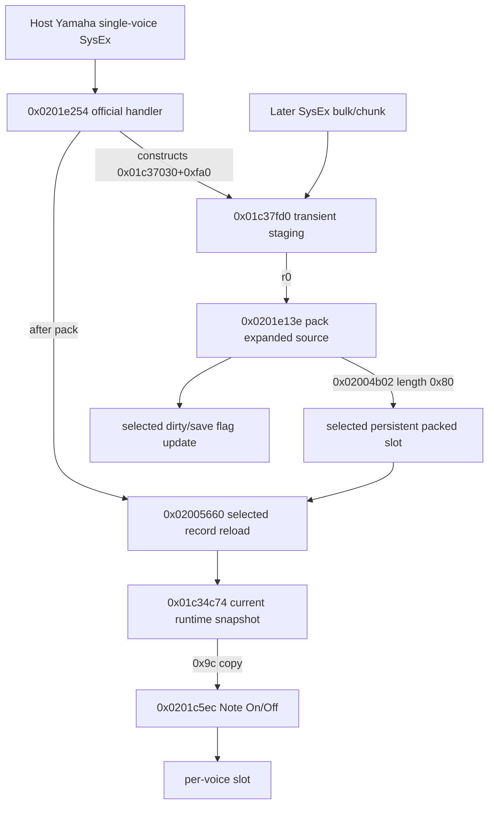

# official v15 SysEx staging lifecycle for 0x01c37fd0

Scope: exact official v15 only. This pass reads `build/v15-official-app.bin`, `build/SMK-37_Pro_015.fwsc`, and the v15 Quarkslab/Kagaimiq listings only. It performs no patching, flashing, live device access, or v12-derived reasoning.

## SHA gates

- app: `36fe8299667d06d4e2c195ea0b125b8e3400a4dc010b45d6989354dd4e172055` (PASS)
- official package: `f7f1831cd7c9ad8b4831b6e71ea0bdbcdff9ae4c4077276b3c965511bf4d4fff` (PASS)
- Quarkslab exhaustive listing: `f51e384f5f0efc415f321bbfbbe15d051301953338191282872807dcf8683347` (PASS)
- Kagaimiq exhaustive listing: `814510c15ba600c7420026204c5f4121bce6a5d074422cc20204755d3280e013` (PASS)

## Verdict

### Proven facts

- The named staging address is not a direct immediate in the app. The handler constructs it as `0x01c37030 + 0x0fa0 = 0x01c37fd0` at `0x0201e3fc` and `0x0201e448`/`0x0201e580` or equivalent add rows.
- Official v15 can materialize a 156-byte single-voice runtime payload at `0x01c37fd0` without boot-time hooks when the already-live handler accepts Yamaha single-voice bulk SysEx. The direct complete-message path checks `F0 43 00 00 01 1B`, copies bytes after the 6-byte header to `0x01c37fd0`, verifies the final byte is `F7`, calls `0x0201e13e(stage)`, then calls `0x02005660` to reload the selected current snapshot.
- The required complete host message for that path is `F0 43 00 00 01 1B` + `0x9c` bytes + `F7`, total `0xa3` bytes. In Yamaha DX7 terminology the `0x9c` staged bytes are the 155 single-voice data bytes plus checksum byte. The handler does not prove a checksum gate on this direct complete-message path before `0x0201e13e`; it proves only the header and terminal `F7` gate.
- `0x0201e468` and `0x0201e49c` are the two official v15 calls from the SysEx handler to `0x0201e13e`. Both are immediately paired with `0x02005660` reload calls at `0x0201e46c` and `0x0201e4a0`.
- `0x0201e13e` consumes the expanded single-voice source pointer in `r0`, packs it into a stack `0x80` buffer, then calls `0x02004b02` with `r0=stack_packed80`, `r1=selected_persistent_slot`, `r2=0x80`. It is a producer for selected persistent backing storage, not a Note On/Off consumer.
- Stock Note On and Note Off consumption still occurs through `0x0201c5ec`, which copies `0x9c` bytes from current snapshot `0x01c34c74` into the allocated voice slot on both Note On and Note Off class paths. The SysEx staging buffer is not the stock dispatcher source.

### Blockers and negative safety result

- A live-booted channel wrapper must not blindly source both Note On and Note Off from `0x01c37fd0`. The staging region is a transient SysEx assembly workspace. Official paths overwrite it for single-voice bulk, segmented single-voice bulk, and larger/other bulk staging paths, and no durable valid/owner/channel generation flag is proven in the traced rows.
- Note Off safety is the hard blocker. If a wrapper rereads `0x01c37fd0` at Note Off, any intervening SysEx bulk write can make the release copy differ from the Note On copy for the same voice. Stock code already copies parameters into the voice slot at Note On; a safe separation design must preserve per-voice identity or store a validated per-channel/per-voice copy, not rely on the global staging workspace staying unchanged.
- The handler has runtime gates not resolved by static listing alone: `0x0201e3ee` returns when `obj+0x206 == 0`, and `obj+0x104` selects staging subpaths. This does not require boot-time hooks, but host success requires the device to be in a state where the official handler accepts the message.
- This pass proves the message shape and copy/pack/reload lifecycle statically. It does not prove all USB-MIDI packetization, UI mode setup, checksum semantics, interrupt races, or DMA absence. Those remain live-device or emulator instrumentation blockers, intentionally out of scope here.

## Host message formats observed

| Path | State/gates | Host bytes | Staged bytes | Outcome |
| --- | --- | --- | --- | --- |
| Complete single-voice bulk | `obj+0x206 != 0`, `obj+0x104 == 0`, bytes match `F0 43 00 00 01 1B`, final byte `F7` | `F0 43 00 00 01 1B` + `0x9c` payload/checksum bytes + `F7` | copies `len-6 = 0x9d` bytes to stage, with the first `0x9c` bytes usable by packer and `F7` at `stage+0x9c` | `0x0201e13e(stage)` then `0x02005660()` |
| Segmented/final single-voice bulk | `obj+0x104 == 2`, current offset from `obj+0x9c`, final byte `F7`, accumulated `offset+len == 0x9e` | continuation frame ending in `F7` | copies `len-2` bytes into `stage+offset` | `0x0201e13e(stage)` then `0x02005660()` |
| Initial single-voice segmented path | header variant `F0 43 00 09 20 00` reaches `0x0201e57a` | message bytes after offset 6 | copies `len-6` bytes to stage and stores length at `obj+0x9c` | no pack until final path |
| Single-parameter writer | exactly 7 bytes `F0 43 10 aa bb dd F7` | no stage use | writes one byte to `0x01c33260 + 0x1a14 + (((aa << 7) + bb) & 0xff)` | direct current snapshot mutation, not staging |

## Lifecycle



## Key rows

### complete single-voice bulk path

- `0201e3ee	50ee7602	lb.z	lb.z r0,[r7 + 0x206]	FALL_THROUGH	FUN_0201e254@0201e254`
- `0201e3f8	50ee7401	lb.z	lb.z r0,[r7 + 0x104]	FALL_THROUGH	FUN_0201e254@0201e254`
- `0201e3fc	c6ff3070c301	mov	mov r6,#0x1c37030	FALL_THROUGH	FUN_0201e254@0201e254`
- `0201e40e	4840	lb.z	lb.z r0,[r4 + 0x0]	FALL_THROUGH	FUN_0201e254@0201e254`
- `0201e410	90f8f9e0	jne	jne r0,#0xf0	CONDITIONAL_JUMP	FUN_0201e254@0201e254`
- `0201e414	4841	lb.z	lb.z r0,[r4 + 0x1]	FALL_THROUGH	FUN_0201e254@0201e254`
- `0201e416	80f8f686	jne	jne r0,#0x43,0x0201e606	CONDITIONAL_JUMP	FUN_0201e254@0201e254`
- `0201e41a	4842	lb.z	lb.z r0,[r4 + 0x2]	FALL_THROUGH	FUN_0201e254@0201e254`
- `0201e41c	8049	jnz	jnz r0,0x0201e430	CONDITIONAL_JUMP	FUN_0201e254@0201e254`
- `0201e430	4842	lb.z	lb.z r0,[r4 + 0x2]	FALL_THROUGH	FUN_0201e254@0201e254`
- `0201e436	4843	lb.z	lb.z r0,[r4 + 0x3]	FALL_THROUGH	FUN_0201e254@0201e254`
- `0201e43c	4844	lb.z	lb.z r0,[r4 + 0x4]	FALL_THROUGH	FUN_0201e254@0201e254`
- `0201e442	4845	lb.z	lb.z r0,[r4 + 0x5]	FALL_THROUGH	FUN_0201e254@0201e254`
- `0201e448	08e1a06f	add	add r8,r6,#0xfa0	FALL_THROUGH	FUN_0201e254@0201e254`
- `0201e44c	4986	add	add r1,r4,#0x6	FALL_THROUGH	FUN_0201e254@0201e254`
- `0201e44e	36e1fa9f	add	add r6,r9,#-0x6	FALL_THROUGH	FUN_0201e254@0201e254`
- `0201e452	8016	mov	mov r0,r8	FALL_THROUGH	FUN_0201e254@0201e254`
- `0201e454	6216	mov	mov r2,r6	FALL_THROUGH	FUN_0201e254@0201e254`
- `0201e456	80ff72a80200	call	call 0x02048cce	UNCONDITIONAL_CALL	FUN_0201e254@0201e254`
- `0201e45c	b4e04009	add	add r0,r4,r9	FALL_THROUGH	FUN_0201e254@0201e254`
- `0201e460	085f	lb.z	lb.z r0,[r0 + -0x1]	FALL_THROUGH	FUN_0201e254@0201e254`
- `0201e462	90f8cbee	jne	jne r0,#0xf7	CONDITIONAL_JUMP	FUN_0201e254@0201e254`
- `0201e466	8016	mov	mov r0,r8	FALL_THROUGH	FUN_0201e254@0201e254`
- `0201e468	bfea69fe	call	call 0x0201e13e	UNCONDITIONAL_CALL	FUN_0201e254@0201e254`
- `0201e46c	bfeaf838	call	call 0x02005660	UNCONDITIONAL_CALL	FUN_0201e254@0201e254`

### segmented final single-voice path

- `0201e472	50ed7c09	lh.z	lh.z r0,[r7 + 0x9c]	FALL_THROUGH	FUN_0201e254@0201e254`
- `0201e476	b4e04019	add	add r1,r4,r9	FALL_THROUGH	FUN_0201e254@0201e254`
- `0201e47a	b4f00059	add	add r5,r0,r9	FALL_THROUGH	FUN_0201e254@0201e254`
- `0201e47e	195f	_lb.z	_lb.z r1,[r1 + -0x1]	FALL_THROUGH	FUN_0201e254@0201e254`
- `0201e480	91f849ee	jne	jne r1,#0xf7	CONDITIONAL_JUMP	FUN_0201e254@0201e254`
- `0201e484	95f8583c	jne	jne r5,#0x9e	CONDITIONAL_JUMP	FUN_0201e254@0201e254`
- `0201e488	06e1a06f	add	add r6,r6,#0xfa0	FALL_THROUGH	FUN_0201e254@0201e254`
- `0201e48c	6018	add	add r0,r6	FALL_THROUGH	FUN_0201e254@0201e254`
- `0201e48e	32e1fe9f	add	add r2,r9,#-0x2	FALL_THROUGH	FUN_0201e254@0201e254`
- `0201e492	4116	mov	mov r1,r4	FALL_THROUGH	FUN_0201e254@0201e254`
- `0201e494	80ff34a80200	call	call 0x02048cce	UNCONDITIONAL_CALL	FUN_0201e254@0201e254`
- `0201e49a	6016	mov	mov r0,r6	FALL_THROUGH	FUN_0201e254@0201e254`
- `0201e49c	bfea4ffe	call	call 0x0201e13e	UNCONDITIONAL_CALL	FUN_0201e254@0201e254`
- `0201e4a0	bfeade38	call	call 0x02005660	UNCONDITIONAL_CALL	FUN_0201e254@0201e254`

### other staging overwrite paths

- `0201e4c0	6018	add	add r0,r6	FALL_THROUGH	FUN_0201e254@0201e254`
- `0201e4c2	00e1a00f	add	add r0,r0,#0xfa0	FALL_THROUGH	FUN_0201e254@0201e254`
- `0201e4c6	35e1fe9f	add	add r5,r9,#-0x2	FALL_THROUGH	FUN_0201e254@0201e254`
- `0201e4ca	4116	mov	mov r1,r4	FALL_THROUGH	FUN_0201e254@0201e254`
- `0201e4cc	5216	mov	mov r2,r5	FALL_THROUGH	FUN_0201e254@0201e254`
- `0201e4ce	80fffaa70200	call	call 0x02048cce	UNCONDITIONAL_CALL	FUN_0201e254@0201e254`
- `0201e516	95fc0438	jbe	jbe r5,0x9c,0x0201e522	CONDITIONAL_JUMP	FUN_0201e254@0201e254`
- `0201e522	6018	add	add r0,r6	FALL_THROUGH	FUN_0201e254@0201e254`
- `0201e524	00e1a00f	add	add r0,r0,#0xfa0	FALL_THROUGH	FUN_0201e254@0201e254`
- `0201e528	4116	mov	mov r1,r4	FALL_THROUGH	FUN_0201e254@0201e254`
- `0201e52a	9216	mov	mov r2,r9	FALL_THROUGH	FUN_0201e254@0201e254`
- `0201e52c	80ff9ca70200	call	call 0x02048cce	UNCONDITIONAL_CALL	FUN_0201e254@0201e254`
- `0201e57a	4021	mov	mov r0,#0x1	FALL_THROUGH	FUN_0201e254@0201e254`
- `0201e580	00e1a06f	add	add r0,r6,#0xfa0	FALL_THROUGH	FUN_0201e254@0201e254`
- `0201e584	4986	add	add r1,r4,#0x6	FALL_THROUGH	FUN_0201e254@0201e254`
- `0201e586	34e1fa9f	add	add r4,r9,#-0x6	FALL_THROUGH	FUN_0201e254@0201e254`
- `0201e58a	4216	mov	mov r2,r4	FALL_THROUGH	FUN_0201e254@0201e254`
- `0201e58c	80ff3ca70200	call	call 0x02048cce	UNCONDITIONAL_CALL	FUN_0201e254@0201e254`
- `0201e592	50ed7d49	sh	sh r4,[r7 + 0x9c]	FALL_THROUGH	FUN_0201e254@0201e254`

### single parameter writer and MIDI fallback

- `0201e606	89f8180e	jne	jne r9,#0x7,0x0201e63a	CONDITIONAL_JUMP	FUN_0201e254@0201e254`
- `0201e60a	4840	lb.z	lb.z r0,[r4 + 0x0]	FALL_THROUGH	FUN_0201e254@0201e254`
- `0201e610	4841	lb.z	lb.z r0,[r4 + 0x1]	FALL_THROUGH	FUN_0201e254@0201e254`
- `0201e616	4842	lb.z	lb.z r0,[r4 + 0x2]	FALL_THROUGH	FUN_0201e254@0201e254`
- `0201e61c	4846	lb.z	lb.z r0,[r4 + 0x6]	FALL_THROUGH	FUN_0201e254@0201e254`
- `0201e622	42f0141a	movz	movz r2,#0x1a14	FALL_THROUGH	FUN_0201e254@0201e254`
- `0201e626	4843	_lb.z	_lb.z r0,[r4 + 0x3]	FALL_THROUGH	FUN_0201e254@0201e254`
- `0201e628	4944	lb.z	lb.z r1,[r4 + 0x4]	FALL_THROUGH	FUN_0201e254@0201e254`
- `0201e62a	00a7	lsl	lsl r0,r0,0x7	FALL_THROUGH	FUN_0201e254@0201e254`
- `0201e62c	10d8	add	add r0,r1	FALL_THROUGH	FUN_0201e254@0201e254`
- `0201e62e	4945	_lb.z	_lb.z r1,[r4 + 0x5]	FALL_THROUGH	FUN_0201e254@0201e254`
- `0201e630	0017	uxtb	uxtb r0,r0	FALL_THROUGH	FUN_0201e254@0201e254`
- `0201e632	7018	add	add r0,r7	FALL_THROUGH	FUN_0201e254@0201e254`
- `0201e634	d8ee0112	sb	sb r1,[r0 + r2]	FALL_THROUGH	FUN_0201e254@0201e254`
- `0201e640	4116	mov	mov r1,r4	FALL_THROUGH	FUN_0201e254@0201e254`
- `0201e642	9216	mov	mov r2,r9	FALL_THROUGH	FUN_0201e254@0201e254`
- `0201e644	bfead2ef	call	call 0x0201c5ec	UNCONDITIONAL_CALL	FUN_0201e254@0201e254`

### packer sink

- `0201e216	c4ff6032c301	mov	mov r4,#0x1c33260	FALL_THROUGH	-`
- `0201e21c	05e1a043	add	add r5,r4,#0x3a0	FALL_THROUGH	-`
- `0201e220	5844	lb.z	lb.z r0,[r5 + 0x4]	FALL_THROUGH	-`
- `0201e222	d1ec4016	ldw	ldw r1,r4,#0x160	FALL_THROUGH	-`
- `0201e226	d8ee0025	lb.z	lb.z r2,[r0 + r5]	FALL_THROUGH	-`
- `0201e22a	00ac	lsl	lsl r0,r0,0xc	FALL_THROUGH	-`
- `0201e22c	1018	add	add r0,r1	FALL_THROUGH	-`
- `0201e22e	21a7	lsl	lsl r1,r2,0x7	FALL_THROUGH	-`
- `0201e230	0118	add	add r1,r0	FALL_THROUGH	-`
- `0201e232	6220	mov	mov r2,#0x80	FALL_THROUGH	-`
- `0201e234	3016	mov	mov r0,r3	FALL_THROUGH	-`
- `0201e236	bfea6434	call	call 0x02004b02	UNCONDITIONAL_CALL	-`
- `0201e23a	5844	lb.z	lb.z r0,[r5 + 0x4]	FALL_THROUGH	-`
- `0201e23c	d8ee0015	lb.z	lb.z r1,[r0 + r5]	FALL_THROUGH	-`
- `0201e240	00a5	lsl	lsl r0,r0,0x5	FALL_THROUGH	-`
- `0201e242	1018	add	add r0,r1	FALL_THROUGH	-`
- `0201e244	4018	add	add r0,r4	FALL_THROUGH	-`
- `0201e246	41e09c12	movz	movz r1,#0x129c	FALL_THROUGH	-`
- `0201e24a	4220	mov	mov r2,#0x0	FALL_THROUGH	-`

### note dispatcher consumers

- `0201c602	c8ff744cc301	mov	mov r8,#0x1c34c74	FALL_THROUGH	FUN_0201c5ec@0201c5ec`
- `0201c630	e1e1a020	mul	mul r1,r2,#0xa0	FALL_THROUGH	FUN_0201c5ec@0201c5ec`
- `0201c636	00e1a260	add	add r0,r6,#0xa2	FALL_THROUGH	FUN_0201c5ec@0201c5ec`
- `0201c63a	623c	mov	mov r2,#0x9c	FALL_THROUGH	FUN_0201c5ec@0201c5ec`
- `0201c63c	8116	mov	mov r1,r8	FALL_THROUGH	FUN_0201c5ec@0201c5ec`
- `0201c63e	80ff8ac60200	call	call 0x02048cce	UNCONDITIONAL_CALL	FUN_0201c5ec@0201c5ec`
- `0201c666	72f1f040	and	and r2,r4,#0xffffff0f	FALL_THROUGH	FUN_0201c5ec@0201c5ec`
- `0201c66c	e1f1a020	mul	mul r1,r2,#0xa0	FALL_THROUGH	FUN_0201c5ec@0201c5ec`
- `0201c674	00e1a270	add	add r0,r7,#0xa2	FALL_THROUGH	FUN_0201c5ec@0201c5ec`
- `0201c678	623c	mov	mov r2,#0x9c	FALL_THROUGH	FUN_0201c5ec@0201c5ec`
- `0201c67a	8116	mov	mov r1,r8	FALL_THROUGH	FUN_0201c5ec@0201c5ec`
- `0201c67c	80ff4cc60200	call	call 0x02048cce	UNCONDITIONAL_CALL	FUN_0201c5ec@0201c5ec`

## Call xrefs

### `0x0201e13e`

- `0201e468	bfea69fe	call	call 0x0201e13e	UNCONDITIONAL_CALL	FUN_0201e254@0201e254`
- `0201e49c	bfea4ffe	call	call 0x0201e13e	UNCONDITIONAL_CALL	FUN_0201e254@0201e254`
- `02026dac	bfeac7b9	call	call 0x0201e13e	UNCONDITIONAL_CALL	-`

### `0x02005660`

- `02005f9c	bfea60fb	call	call 0x02005660	UNCONDITIONAL_CALL	-`
- `0201e46c	bfeaf838	call	call 0x02005660	UNCONDITIONAL_CALL	FUN_0201e254@0201e254`
- `0201e4a0	bfeade38	call	call 0x02005660	UNCONDITIONAL_CALL	FUN_0201e254@0201e254`
- `0202422e	bfea170a	call	call 0x02005660	UNCONDITIONAL_CALL	FUN_020241e0@020241e0`
- `020255a6	bfea5b00	call	call 0x02005660	UNCONDITIONAL_CALL	-`

### `0x0201c5ec`

- `0201c736	bfea59ff	call	call 0x0201c5ec	UNCONDITIONAL_CALL	FUN_0201c722@0201c722`
- `0201e644	bfead2ef	call	call 0x0201c5ec	UNCONDITIONAL_CALL	FUN_0201e254@0201e254`

### `0x02048cce`

- `02000060	80ff688c0400	call	call 0x02048cce	UNCONDITIONAL_CALL	-`
- `02000546	80ff82870400	call	call 0x02048cce	UNCONDITIONAL_CALL	FUN_020004b8@020004b8`
- `02000556	80ff72870400	call	call 0x02048cce	UNCONDITIONAL_CALL	FUN_020004b8@020004b8`
- `02000568	80ff60870400	call	call 0x02048cce	UNCONDITIONAL_CALL	FUN_020004b8@020004b8`
- `020007b6	80ff12850400	call	call 0x02048cce	UNCONDITIONAL_CALL	-`
- `02000e8a	80ff3e7e0400	call	call 0x02048cce	UNCONDITIONAL_CALL	-`
- `02000eb8	80ff107e0400	call	call 0x02048cce	UNCONDITIONAL_CALL	-`
- `02000ee2	80ffe67d0400	call	call 0x02048cce	UNCONDITIONAL_CALL	-`
- `02000efe	80ffca7d0400	call	call 0x02048cce	UNCONDITIONAL_CALL	-`
- `02001044	80ff847c0400	call	call 0x02048cce	UNCONDITIONAL_CALL	-`
- `020010b6	80ff127c0400	call	call 0x02048cce	UNCONDITIONAL_CALL	FUN_02001050@02001050`
- `0200119e	80ff2a7b0400	call	call 0x02048cce	UNCONDITIONAL_CALL	FUN_02001050@02001050`
- `020011b2	80ff167b0400	call	call 0x02048cce	UNCONDITIONAL_CALL	FUN_02001050@02001050`
- `0200124e	80ff7a7a0400	call	call 0x02048cce	UNCONDITIONAL_CALL	FUN_02001050@02001050`
- `0200128a	80ff3e7a0400	call	call 0x02048cce	UNCONDITIONAL_CALL	FUN_02001050@02001050`
- `0200129c	80ff2c7a0400	call	call 0x02048cce	UNCONDITIONAL_CALL	FUN_02001050@02001050`
- `02001346	80ff82790400	call	call 0x02048cce	UNCONDITIONAL_CALL	FUN_02001050@02001050`
- `02001358	80ff70790400	call	call 0x02048cce	UNCONDITIONAL_CALL	FUN_02001050@02001050`
- `0200143a	80ff8e780400	call	call 0x02048cce	UNCONDITIONAL_CALL	-`
- `020014a2	80ff26780400	call	call 0x02048cce	UNCONDITIONAL_CALL	-`
- `02002f8a	80ff3e5d0400	call	call 0x02048cce	UNCONDITIONAL_CALL	FUN_02002e7e@02002e7e`
- `020039cc	80fffc520400	call	call 0x02048cce	UNCONDITIONAL_CALL	FUN_0200392a@0200392a`
- `020039fe	80ffca520400	call	call 0x02048cce	UNCONDITIONAL_CALL	FUN_0200392a@0200392a`
- `02003a90	80ff38520400	call	call 0x02048cce	UNCONDITIONAL_CALL	FUN_0200392a@0200392a`
- `02004866	80ff62440400	call	call 0x02048cce	UNCONDITIONAL_CALL	FUN_020047d8@020047d8`
- `02005134	80ff943b0400	call	call 0x02048cce	UNCONDITIONAL_CALL	FUN_0200506a@0200506a`
- `0200569a	80ff2e360400	call	call 0x02048cce	UNCONDITIONAL_CALL	FUN_02005660@02005660`
- `0200662c	80ff9c260400	call	call 0x02048cce	UNCONDITIONAL_CALL	-`
- `020074e6	80ffe2170400	call	call 0x02048cce	UNCONDITIONAL_CALL	-`
- `020074f6	80ffd2170400	call	call 0x02048cce	UNCONDITIONAL_CALL	-`
- `02007586	80ff42170400	call	call 0x02048cce	UNCONDITIONAL_CALL	FUN_02007552@02007552`
- `02007fa4	80ff240d0400	call	call 0x02048cce	UNCONDITIONAL_CALL	-`
- `02007fb0	80ff180d0400	call	call 0x02048cce	UNCONDITIONAL_CALL	-`
- `020083a6	80ff22090400	call	call 0x02048cce	UNCONDITIONAL_CALL	FUN_020081d0@020081d0`
- `02008630	80ff98060400	call	call 0x02048cce	UNCONDITIONAL_CALL	FUN_02008444@02008444`
- `02008666	80ff62060400	call	call 0x02048cce	UNCONDITIONAL_CALL	FUN_02008444@02008444`
- `02008678	80ff50060400	call	call 0x02048cce	UNCONDITIONAL_CALL	FUN_02008444@02008444`
- `02008d74	80ff54ff0300	call	call 0x02048cce	UNCONDITIONAL_CALL	FUN_02008ce8@02008ce8`
- `02008f6c	80ff5cfd0300	call	call 0x02048cce	UNCONDITIONAL_CALL	-`
- `020092c0	80ff08fa0300	call	call 0x02048cce	UNCONDITIONAL_CALL	-`
- `02009360	80ff68f90300	call	call 0x02048cce	UNCONDITIONAL_CALL	-`
- `02009544	80ff84f70300	call	call 0x02048cce	UNCONDITIONAL_CALL	-`
- `02009564	80ff64f70300	call	call 0x02048cce	UNCONDITIONAL_CALL	-`
- `020098a4	80ff24f40300	call	call 0x02048cce	UNCONDITIONAL_CALL	-`
- `0201114e	80ff7a7b0300	call	call 0x02048cce	UNCONDITIONAL_CALL	FUN_0201107a@0201107a`
- `0201c52c	80ff9cc70200	call	call 0x02048cce	UNCONDITIONAL_CALL	FUN_0201c4e4@0201c4e4`
- `0201c53c	80ff8cc70200	call	call 0x02048cce	UNCONDITIONAL_CALL	FUN_0201c4e4@0201c4e4`
- `0201c63e	80ff8ac60200	call	call 0x02048cce	UNCONDITIONAL_CALL	FUN_0201c5ec@0201c5ec`
- `0201c67c	80ff4cc60200	call	call 0x02048cce	UNCONDITIONAL_CALL	FUN_0201c5ec@0201c5ec`
- `0201df50	80ff78ad0200	call	call 0x02048cce	UNCONDITIONAL_CALL	-`
- `0201dfa2	80ff26ad0200	call	call 0x02048cce	UNCONDITIONAL_CALL	-`
- `0201e02c	80ff9cac0200	call	call 0x02048cce	UNCONDITIONAL_CALL	-`
- `0201e456	80ff72a80200	call	call 0x02048cce	UNCONDITIONAL_CALL	FUN_0201e254@0201e254`
- `0201e494	80ff34a80200	call	call 0x02048cce	UNCONDITIONAL_CALL	FUN_0201e254@0201e254`
- `0201e4ce	80fffaa70200	call	call 0x02048cce	UNCONDITIONAL_CALL	FUN_0201e254@0201e254`
- `0201e52c	80ff9ca70200	call	call 0x02048cce	UNCONDITIONAL_CALL	FUN_0201e254@0201e254`
- `0201e58c	80ff3ca70200	call	call 0x02048cce	UNCONDITIONAL_CALL	FUN_0201e254@0201e254`
- `02023322	80ffa6590200	call	call 0x02048cce	UNCONDITIONAL_CALL	FUN_0202330c@0202330c`
- `02023582	80ff46570200	call	call 0x02048cce	UNCONDITIONAL_CALL	FUN_020234a4@020234a4`
- `02023594	80ff34570200	call	call 0x02048cce	UNCONDITIONAL_CALL	FUN_020234a4@020234a4`
- `0202af40	80ff88dd0100	call	call 0x02048cce	UNCONDITIONAL_CALL	FUN_0202af0c@0202af0c`
- `0202b860	80ff68d40100	call	call 0x02048cce	UNCONDITIONAL_CALL	-`
- `0202b90c	80ffbcd30100	call	call 0x02048cce	UNCONDITIONAL_CALL	-`
- `0202b930	80ff98d30100	call	call 0x02048cce	UNCONDITIONAL_CALL	-`
- `0202b966	80ff62d30100	call	call 0x02048cce	UNCONDITIONAL_CALL	-`
- `0202bafc	80ffccd10100	call	call 0x02048cce	UNCONDITIONAL_CALL	FUN_0202ba58@0202ba58`
- `0202bb12	80ffb6d10100	call	call 0x02048cce	UNCONDITIONAL_CALL	FUN_0202ba58@0202ba58`
- `0202c192	80ff36cb0100	call	call 0x02048cce	UNCONDITIONAL_CALL	-`
- `0202c1ea	80ffdeca0100	call	call 0x02048cce	UNCONDITIONAL_CALL	-`
- `0202c34c	80ff7cc90100	call	call 0x02048cce	UNCONDITIONAL_CALL	FUN_0202c238@0202c238`
- `0202c39a	80ff2ec90100	call	call 0x02048cce	UNCONDITIONAL_CALL	FUN_0202c238@0202c238`
- `0202c3ac	80ff1cc90100	call	call 0x02048cce	UNCONDITIONAL_CALL	FUN_0202c238@0202c238`
- `0202cfae	80ff1abd0100	call	call 0x02048cce	UNCONDITIONAL_CALL	FUN_0202cf42@0202cf42`
- `0202cfc0	80ff08bd0100	call	call 0x02048cce	UNCONDITIONAL_CALL	FUN_0202cf42@0202cf42`
- `0202d176	80ff52bb0100	call	call 0x02048cce	UNCONDITIONAL_CALL	FUN_0202d15a@0202d15a`
- `0202d1ae	80ff1abb0100	call	call 0x02048cce	UNCONDITIONAL_CALL	FUN_0202d15a@0202d15a`
- `0202d2c0	80ff08ba0100	call	call 0x02048cce	UNCONDITIONAL_CALL	FUN_0202d28c@0202d28c`
- `0202d2d0	80fff8b90100	call	call 0x02048cce	UNCONDITIONAL_CALL	FUN_0202d28c@0202d28c`
- `0202d506	80ffc2b70100	call	call 0x02048cce	UNCONDITIONAL_CALL	-`
- `0202d7f6	80ffd2b40100	call	call 0x02048cce	UNCONDITIONAL_CALL	FUN_0202d7c0@0202d7c0`
- `0202dcd0	80fff8af0100	call	call 0x02048cce	UNCONDITIONAL_CALL	-`
- `0202ee62	80ff669e0100	call	call 0x02048cce	UNCONDITIONAL_CALL	FUN_0202ecd8@0202ecd8`
- `0202eef8	80ffd09d0100	call	call 0x02048cce	UNCONDITIONAL_CALL	FUN_0202eee6@0202eee6`
- `0202f284	80ff449a0100	call	call 0x02048cce	UNCONDITIONAL_CALL	FUN_0202eee6@0202eee6`
- `0202fcbe	80ff0a900100	call	call 0x02048cce	UNCONDITIONAL_CALL	caseD_202fb8c@0202fb8c`
- `0202fdd6	80fff28e0100	call	call 0x02048cce	UNCONDITIONAL_CALL	caseD_202fb8c@0202fb8c`
- `0202fe16	80ffb28e0100	call	call 0x02048cce	UNCONDITIONAL_CALL	FUN_0202fde8@0202fde8`
- `0202ff62	80ff668d0100	call	call 0x02048cce	UNCONDITIONAL_CALL	FUN_0202fe92@0202fe92`
- `02030002	80ffc68c0100	call	call 0x02048cce	UNCONDITIONAL_CALL	FUN_0202fe92@0202fe92`
- `0203000e	80ffba8c0100	call	call 0x02048cce	UNCONDITIONAL_CALL	FUN_0202fe92@0202fe92`
- `0203002a	80ff9e8c0100	call	call 0x02048cce	UNCONDITIONAL_CALL	FUN_0202fe92@0202fe92`
- `020301ba	80ff0e8b0100	call	call 0x02048cce	UNCONDITIONAL_CALL	FUN_02030168@02030168`
- `02030676	80ff52860100	call	call 0x02048cce	UNCONDITIONAL_CALL	FUN_0203063c@0203063c`
- `0203068a	80ff3e860100	call	call 0x02048cce	UNCONDITIONAL_CALL	FUN_0203063c@0203063c`
- `0203076c	80ff5c850100	call	call 0x02048cce	UNCONDITIONAL_CALL	FUN_02030716@02030716`
- `020308d0	80fff8830100	call	call 0x02048cce	UNCONDITIONAL_CALL	FUN_020308ba@020308ba`
- `02030a70	80ff58820100	call	call 0x02048cce	UNCONDITIONAL_CALL	FUN_02030a1e@02030a1e`
- `020319da	80ffee720100	call	call 0x02048cce	UNCONDITIONAL_CALL	-`
- `02031ca4	80ff24700100	call	call 0x02048cce	UNCONDITIONAL_CALL	FUN_02031bde@02031bde`
- `02031d1a	80ffae6f0100	call	call 0x02048cce	UNCONDITIONAL_CALL	FUN_02031cc2@02031cc2`
- `02031e30	80ff986e0100	call	call 0x02048cce	UNCONDITIONAL_CALL	FUN_02031d64@02031d64`
- `0203219a	80ff2e6b0100	call	call 0x02048cce	UNCONDITIONAL_CALL	FUN_0203202a@0203202a`
- `020324a2	80ff26680100	call	call 0x02048cce	UNCONDITIONAL_CALL	FUN_020323fa@020323fa`
- `020325e4	80ffe4660100	call	call 0x02048cce	UNCONDITIONAL_CALL	FUN_020323fa@020323fa`
- `02032634	80ff94660100	call	call 0x02048cce	UNCONDITIONAL_CALL	FUN_020323fa@020323fa`
- `020329c2	80ff06630100	call	call 0x02048cce	UNCONDITIONAL_CALL	FUN_02032902@02032902`
- `02032a9c	80ff2c620100	call	call 0x02048cce	UNCONDITIONAL_CALL	FUN_02032a34@02032a34`
- `02032ac4	80ff04620100	call	call 0x02048cce	UNCONDITIONAL_CALL	FUN_02032a34@02032a34`
- `02032af8	80ffd0610100	call	call 0x02048cce	UNCONDITIONAL_CALL	-`
- `02032c5e	80ff6a600100	call	call 0x02048cce	UNCONDITIONAL_CALL	-`
- `02032c84	80ff44600100	call	call 0x02048cce	UNCONDITIONAL_CALL	-`
- `02032e1a	80ffae5e0100	call	call 0x02048cce	UNCONDITIONAL_CALL	-`
- `020337f2	80ffd6540100	call	call 0x02048cce	UNCONDITIONAL_CALL	FUN_0203395a@0203395a`
- `020338fe	80ffca530100	call	call 0x02048cce	UNCONDITIONAL_CALL	FUN_02033844@02033844`
- `02033d28	80ffa04f0100	call	call 0x02048cce	UNCONDITIONAL_CALL	FUN_02033cf2@02033cf2`
- `02033df4	80ffd44e0100	call	call 0x02048cce	UNCONDITIONAL_CALL	FUN_02033de8@02033de8`
- `02033e06	80ffc24e0100	call	call 0x02048cce	UNCONDITIONAL_CALL	FUN_02033de8@02033de8`
- `02033e16	80ffb24e0100	call	call 0x02048cce	UNCONDITIONAL_CALL	FUN_02033de8@02033de8`
- `02033ec4	80ff044e0100	call	call 0x02048cce	UNCONDITIONAL_CALL	FUN_02033ea2@02033ea2`
- `02033f98	80ff304d0100	call	call 0x02048cce	UNCONDITIONAL_CALL	FUN_02033f1a@02033f1a`
- `02034454	80ff74480100	call	call 0x02048cce	UNCONDITIONAL_CALL	caseD_a@020343dc`
- `0203452a	80ff9e470100	call	call 0x02048cce	UNCONDITIONAL_CALL	caseD_a@020343dc`
- `020347ea	80ffde440100	call	call 0x02048cce	UNCONDITIONAL_CALL	FUN_020346d4@020346d4`
- `0203483e	80ff8a440100	call	call 0x02048cce	UNCONDITIONAL_CALL	FUN_020346d4@020346d4`
- `020348b4	80ff14440100	call	call 0x02048cce	UNCONDITIONAL_CALL	-`
- `020348d2	80fff6430100	call	call 0x02048cce	UNCONDITIONAL_CALL	-`
- `02034904	80ffc4430100	call	call 0x02048cce	UNCONDITIONAL_CALL	-`
- `02034958	80ff70430100	call	call 0x02048cce	UNCONDITIONAL_CALL	-`
- `02034b72	80ff56410100	call	call 0x02048cce	UNCONDITIONAL_CALL	FUN_02034b10@02034b10`
- `02034d9a	80ff2e3f0100	call	call 0x02048cce	UNCONDITIONAL_CALL	FUN_02034cd6@02034cd6`
- `02034e48	80ff803e0100	call	call 0x02048cce	UNCONDITIONAL_CALL	FUN_02034cd6@02034cd6`
- `020354e0	80ffe8370100	call	call 0x02048cce	UNCONDITIONAL_CALL	caseD_e@020354d2`
- `020354f6	80ffd2370100	call	call 0x02048cce	UNCONDITIONAL_CALL	caseD_e@020354d2`
- `0203550c	80ffbc370100	call	call 0x02048cce	UNCONDITIONAL_CALL	caseD_e@020354d2`
- `02035738	80ff90350100	call	call 0x02048cce	UNCONDITIONAL_CALL	FUN_0203572a@0203572a`
- `02037c20	80ffa8100100	call	call 0x02048cce	UNCONDITIONAL_CALL	-`
- `02037c8a	80ff3e100100	call	call 0x02048cce	UNCONDITIONAL_CALL	-`
- `02037f9a	80ff2e0d0100	call	call 0x02048cce	UNCONDITIONAL_CALL	-`
- `02038224	80ffa40a0100	call	call 0x02048cce	UNCONDITIONAL_CALL	-`
- `0203936c	80ff5cf90000	call	call 0x02048cce	UNCONDITIONAL_CALL	FUN_0203935e@0203935e`
- `0203a40a	80ffbee80000	call	call 0x02048cce	UNCONDITIONAL_CALL	-`
- `0203cff6	80ffd2bc0000	call	call 0x02048cce	UNCONDITIONAL_CALL	-`
- `0203d224	80ffa4ba0000	call	call 0x02048cce	UNCONDITIONAL_CALL	FUN_0203d1fe@0203d1fe`
- `0203d4b4	80ff14b80000	call	call 0x02048cce	UNCONDITIONAL_CALL	caseD_4@0203d412`
- `0203dc0e	80ffbab00000	call	call 0x02048cce	UNCONDITIONAL_CALL	FUN_0203dba2@0203dba2`
- `0203e3e2	80ffe6a80000	call	call 0x02048cce	UNCONDITIONAL_CALL	FUN_0203e3ae@0203e3ae`
- `02040c88	80ff40800000	call	call 0x02048cce	UNCONDITIONAL_CALL	-`
- `02040ca0	80ff28800000	call	call 0x02048cce	UNCONDITIONAL_CALL	-`
- `02041bbe	80ff0a710000	call	call 0x02048cce	UNCONDITIONAL_CALL	FUN_02041b7a@02041b7a`

## Raw pointer xrefs

- `stage_0x01c37fd0` `0x01c37fd0`: count `0`, refs none
- `stage_base_0x01c37030` `0x01c37030`: count `6`, refs `0x02008b80`, `0x0201bed4`, `0x0201c2e0`, `0x0201e3fe`, `0x0202552a`, `0x0208fe66`
- `obj_0x01c33260` `0x01c33260`: count `492`, refs `0x02000696`, `0x020006a8`, `0x020006ba`, `0x020006d0`, `0x020006de`, `0x020006f0`, `0x020007ea`, `0x02000816`, `0x0200083e`, `0x02000856`, `0x0200089c`, `0x02000d56`, `0x02000fb6`, `0x02001066`, `0x02001394`, `0x02001772`, `0x020021e8`, `0x020024ea`, `0x02002570`, `0x020025f2`, `0x02002660`, `0x020026c6`, `0x02003524`, `0x020036a6`, `0x0200444e`, `0x02004654`, `0x0200473c`, `0x02004806`, `0x0200489e`, `0x02004a94`, `0x02004cca`, `0x02004e1c`, `0x02004f0c`, `0x02005070`, `0x02005156`, `0x02005516`, `0x02005584`, `0x02005592`, `0x020055fa`, `0x0200562e`, `0x02005668`, `0x020057f4`, `0x020058c0`, `0x02005e66`, `0x02005fb2`, `0x02006434`, `0x02006794`, `0x020073c2`, `0x020073e6`, `0x0200744e`, `0x020075f2`, `0x02007c1e`, `0x02007eac`, `0x020083fc`, `0x0200849a`, `0x02008ae6`, `0x02008d64`, `0x02009d34`, `0x0200a0e8`, `0x0200a108`, `0x0200a158`, `0x0200a2e6`, `0x0200a31c`, `0x0200a332`, `0x0200a348`, `0x0200a3ee`, `0x0200a478`, `0x0200a4a2`, `0x0200a6e2`, `0x0200a906`, `0x0200aafa`, `0x0200ab14`, `0x0200ac36`, `0x0200ad7c`, `0x0200b16c`, `0x0200ba9c`, `0x0200bafa`, `0x0200e78a`, `0x0200e8ac`, `0x0200f786`, `0x0200fb94`, `0x0200fc3e`, `0x0201003e`, `0x020101a6`, `0x02010316`, `0x02010498`, `0x020104d8`, `0x020105ae`, `0x0201066e`, `0x02011006`, `0x020124c2`, `0x02013e56`, `0x02014ac4`, `0x02014ad8`, `0x02014af0`, `0x02014b12`, `0x02015374`, `0x02015b7c`, `0x02017ac8`, `0x02019f1a`, `0x0201b2f2`, `0x0201b322`, `0x0201b422`, `0x0201b47e`, `0x0201b578`, `0x0201b644`, `0x0201b816`, `0x0201b89a`, `0x0201ba86`, `0x0201bae0`, `0x0201bb0a`, `0x0201bb34`, `0x0201bb5e`, `0x0201bb88`, `0x0201bbce`, `0x0201bbfe`, `0x0201bc28`, `0x0201bc52`, `0x0201bc9c`, `0x0201bdd2`, `0x0201bdf2`, `0x0201beca`, `0x0201bf3e`, `0x0201c2d6`, `0x0201c4ee`, `0x0201c726`, `0x0201c75e`, `0x0201c780`, `0x0201c852`, `0x0201c874`, `0x0201c88a`, `0x0201cacc`, `0x0201caf8`, `0x0201cb6e`, `0x0201cba8`, `0x0201d078`, `0x0201d1aa`, `0x0201d65e`, `0x0201dd14`, `0x0201ddbc`, `0x0201de88`, `0x0201decc`, `0x0201df96`, `0x0201dfc6`, `0x0201e052`, `0x0201e070`, `0x0201e104`, `0x0201e218`, `0x0201e25e`, `0x0201e650`, `0x0201e728`, `0x0201e808`, `0x0201ea18`, `0x0201eac0`, `0x0201eb7a`, `0x0201ef14`, `0x0201efd4`, `0x0201f052`, `0x0201f1b2`, `0x0201f5dc`, `0x0201f84e`, `0x02020386`, `0x02023318`, `0x02023388`, `0x020233fa`, `0x0202355a`, `0x020235ec`, `0x020236b8`, `0x02023772`, `0x0202398e`, `0x02023af2`, `0x02023b0c`, `0x02023b36`, `0x02023c66`, `0x02023cec`, `0x02023d10`, `0x02023e08`, `0x02023fde`, `0x0202407c`, `0x020241e8`, `0x02024286`, `0x020242d6`, `0x02024370`, `0x02024446`, `0x0202457e`, `0x020245ba`, `0x02024940`, `0x02024a5e`, `0x02024d50`, `0x02024e08`, `0x02024e94`, `0x02025000`, `0x020289ca`, `0x02028a84`, `0x02028e4c`, `0x02028e6c`, `0x02028e8e`, `0x02028eae`, `0x02028f10`, `0x020291d0`, `0x020291e8`, `0x020291fc`, `0x02029248`, `0x02029298`, `0x020297fa`, `0x0202981e`, `0x0202985c`, `0x020298b6`, `0x020298da`, `0x02029904`, `0x0202991c`, `0x0202992e`, `0x02029960`, `0x02029992`, `0x020299a6`, `0x020299e0`, `0x02029a94`, `0x02029b06`, `0x02029b1e`, `0x02029b8a`, `0x02029bf4`, `0x02029c28`, `0x02029c56`, `0x02029c8a`, `0x02029ccc`, `0x02029cfa`, `0x02029d20`, `0x02029d66`, `0x02029d9e`, `0x02029de2`, `0x02029e06`, `0x02029e4c`, `0x02029e86`, `0x02029ed8`, `0x02029f46`, `0x02029f6e`, `0x02029fa0`, `0x02029fd8`, `0x0202a00a`, `0x0202a052`, `0x0202a08e`, `0x0202a0ba`, `0x0202a120`, `0x0202a142`, `0x0202a166`, `0x0202a18a`, `0x0202a1ae`, `0x0202a1d2`, `0x0202a1f6`, `0x0202a21c`, `0x0202a248`, `0x0202a274`, `0x0202a29c`, `0x0202a2c4`, `0x0202a338`, `0x0202a360`, `0x0202a388`, `0x0202a3b0`, `0x0202a3dc`, `0x0202a3fa`, `0x0202a416`, `0x0202a432`, `0x0202a44e`, `0x0202a46a`, `0x0202a486`, `0x0202a4a0`, `0x0202a4bc`, `0x0202a4d4`, `0x0202a53c`, `0x0202a5aa`, `0x0202a6dc`, `0x0202a77a`, `0x0202a82e`, `0x0202a90c`, `0x0202a9e8`, `0x0202abb6`, `0x0202ad1e`, `0x0202addc`, `0x0202ae98`, `0x0202af10`, `0x0202af80`, `0x0202aff4`, `0x0202b114`, `0x0202b214`, `0x0202b246`, `0x0202b376`, `0x0202b386`, `0x0202b476`, `0x0202b6a6`, `0x0202b6be`, `0x0202b770`, `0x0202b872`, `0x0202b926`, `0x0202b942`, `0x0202ba26`, `0x0202bf76`, `0x0202bfaa`, `0x0202c004`, `0x0202c0d0`, `0x0202c288`, `0x0202c54e`, `0x0202c568`, `0x0202c5d8`, `0x0202c628`, `0x0202c6b6`, `0x0202c834`, `0x0202c8e4`, `0x0202c922`, `0x0202ca7c`, `0x0202cad0`, `0x0202cdf8`, `0x0202cf48`, `0x0202d03e`, `0x0202d294`, `0x0202d33c`, `0x0202d3b2`, `0x0202d48a`, `0x0202d59a`, `0x0202d5b8`, `0x0202d722`, `0x0202d8a2`, `0x0202da2a`, `0x0202dac8`, `0x0202db9e`, `0x0202ddc4`, `0x0202de8c`, `0x0202e036`, `0x0202e09a`, `0x0202e364`, `0x0202e3ae`, `0x020359ba`, `0x02035fee`, `0x02036f86`, `0x02036fee`, `0x0203726a`, `0x02037316`, `0x020374e4`, `0x02037506`, `0x02037588`, `0x020375e4`, `0x02037908`, `0x02037a06`, `0x02037b74`, `0x02037bda`, `0x02037c4c`, `0x02037cca`, `0x02037cee`, `0x020384de`, `0x02038538`, `0x020385a2`, `0x020387fe`, `0x0203885e`, `0x02038a78`, `0x02038ae4`, `0x02038b86`, `0x02038b9a`, `0x02039870`, `0x020398ee`, `0x0203a0de`, `0x0203a5fc`, `0x0203a752`, `0x0203b91e`, `0x0203c200`, `0x0203c74a`, `0x0203ca02`, `0x0203e0a6`, `0x0203e14e`, `0x0203e29a`, `0x0203e830`, `0x0203ee90`, `0x0203ef52`, `0x0203f126`, `0x02041c5c`, `0x020423e4`, `0x02042690`, `0x020429e0`, `0x02042c7e`, `0x02043006`, `0x020430fa`, `0x0204319e`, `0x0204339a`, `0x020434ea`, `0x020435d2`, `0x020439ce`, `0x02043a5c`, `0x02043cc8`, `0x02043d96`, `0x02043e58`, `0x020441d8`, `0x02044382`, `0x02044448`, `0x020444a2`, `0x020444e2`, `0x02044566`, `0x02044620`, `0x020446b6`, `0x02044868`, `0x02044a3e`, `0x02044ad6`, `0x02044e48`, `0x020452ce`, `0x0204531e`, `0x02045388`, `0x02045424`, `0x02045456`, `0x0204556a`, `0x0204576c`, `0x020457c0`, `0x02045950`, `0x02045c74`, `0x0204621c`, `0x0204692a`, `0x020469fa`, `0x02046b3c`, `0x02046cd6`, `0x02046d78`, `0x02046e96`, `0x02047080`, `0x0205e8f0`, `0x0205e9be`, `0x0205ea54`, `0x0205ea84`, `0x0205fc3e`, `0x0206036e`, `0x02060818`, `0x02060c38`, `0x02060e00`, `0x02063cc2`, `0x0206451e`, `0x0206513e`, `0x020651e8`, `0x02065ad6`, `0x02065b3c`, `0x02065bce`, `0x0206620a`, `0x0206623a`, `0x02066254`, `0x0206626a`, `0x0206642c`, `0x02066fb6`, `0x020693ca`, `0x0206a1fa`, `0x0206c544`, `0x0207ba8c`, `0x0207bcfe`, `0x0207bde8`, `0x0207be24`, `0x0207be38`, `0x0207be68`, `0x0207bf42`, `0x0207c038`, `0x0207c100`, `0x0207c274`, `0x0207c2c4`, `0x0207c448`, `0x0207c4ea`, `0x0207c566`, `0x0207c84a`, `0x0207c986`, `0x0207cada`, `0x0207cbd4`, `0x0207cbec`, `0x0208ae14`, `0x0208ae3a`, `0x0208ae94`, `0x0208b0e2`, `0x0208b254`, `0x0208b3b0`, `0x0208b4de`, `0x0208b5d6`, `0x0208b65a`, `0x0208b68a`, `0x0208bc9c`, `0x0208bcf2`, `0x0208bdb4`, `0x0208bdfe`, `0x0208be12`, `0x0208be94`, `0x0208cd7a`, `0x0208d04e`, `0x0208d446`, `0x0208ddb2`, `0x0208e142`, `0x0208f4f8`, `0x0208fb6c`, `0x020900ce`, `0x020900e2`, `0x0209040e`, `0x02090cee`, `0x0209137a`, `0x02091466`, `0x020914c6`
- `current_0x01c34c74` `0x01c34c74`: count `1`, refs `0x0201c604`

## Reproduce

```sh
python3 baselines/v15/analysis/channel-separation-reanalysis/sysex-staging/trace_sysex_staging.py
cd baselines/v15/analysis/channel-separation-reanalysis/sysex-staging
shasum -a 256 -c SHA256SUMS
```

`validation.txt` records SHA gates, manifest binding, staging arithmetic, required listing rows, caller sets, lack of direct stage immediate, and v12 path exclusion. `sysex_staging_trace.json` contains the same evidence machine-readably.
